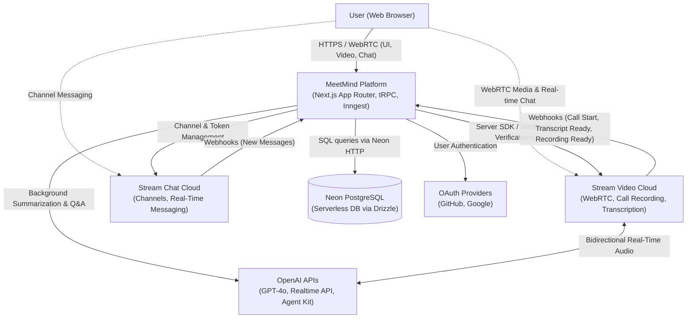
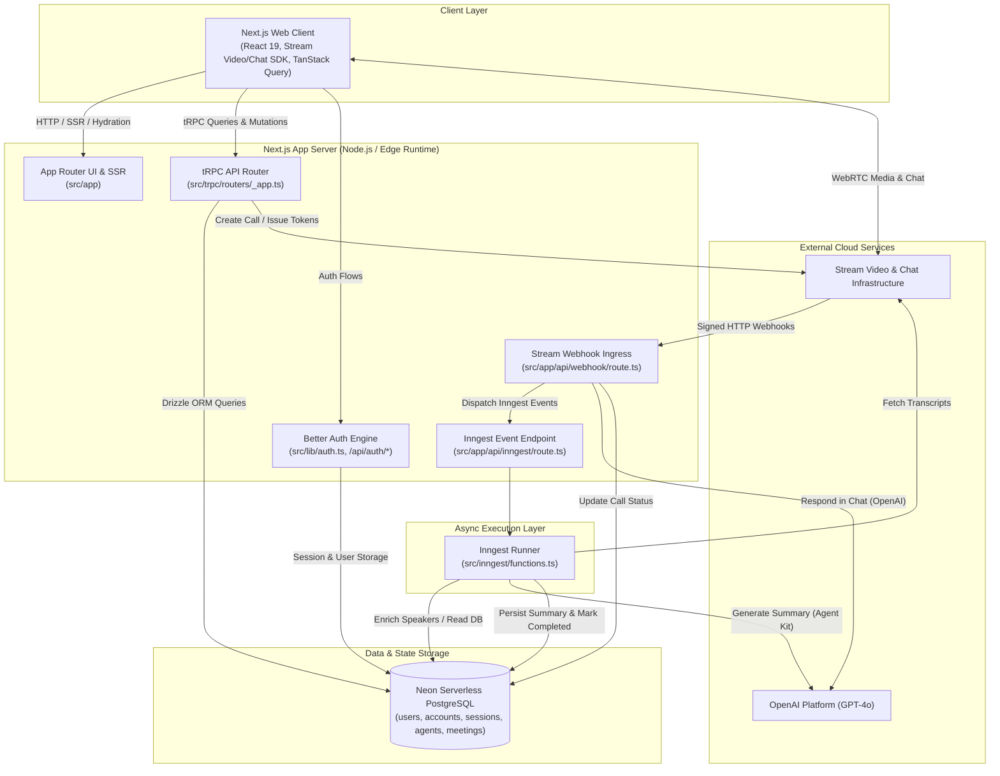
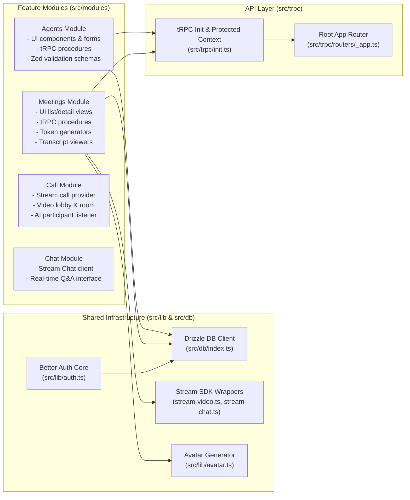
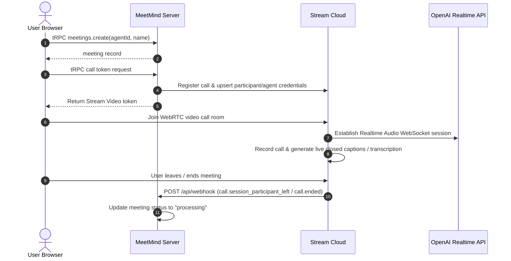
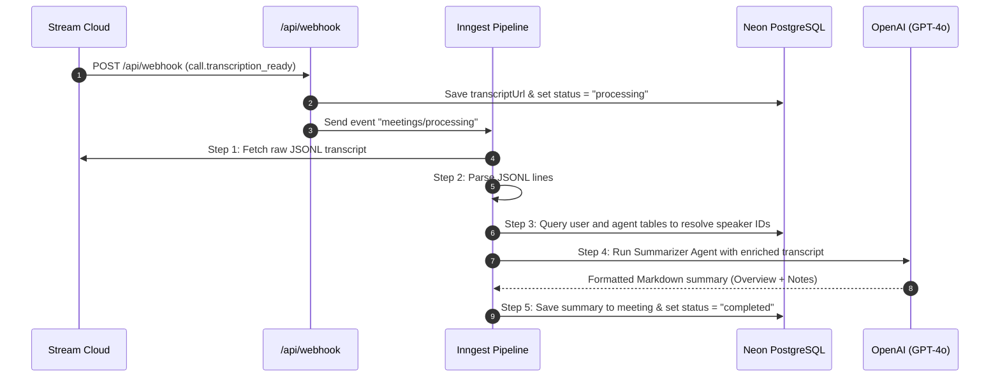
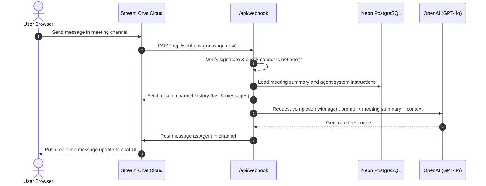

# Architecture — MeetMind

> **Last updated:** 2026-09-24  
> **Authors:** MeetMind Engineering  
> **Status:** Current

## Overview

MeetMind is an AI-powered meeting assistant platform. It allows users to configure custom AI agents, attach those agents directly to live WebRTC video meetings as conversational participants, record and transcribe calls, automatically synthesize speaker-attributed summaries via multi-step background workflows, and interactively query meeting context post-call through real-time chat.

The system is built as a unified full-stack application using Next.js 16 App Router, React 19, TypeScript, tRPC, Drizzle ORM over Neon Serverless PostgreSQL, Stream Video & Chat SDKs, OpenAI (GPT-4o and Realtime API), and Inngest background orchestration.

---

## Level 1 — System Context

The system context diagram shows the high-level boundaries of MeetMind, its users, and all external systems with which it interacts.

### External Dependencies

| System              | Purpose                                                                     | Owner / Provider | Notes                                                                                            |
| ------------------- | --------------------------------------------------------------------------- | ---------------- | ------------------------------------------------------------------------------------------------ |
| **Stream Video**    | WebRTC media routing, recording, transcription, call participant management | Stream.io        | Generates signed webhooks when transcripts and recordings are ready.                             |
| **Stream Chat**     | Real-time meeting chat channels and post-call conversational threads        | Stream.io        | Webhooks trigger AI agent replies.                                                               |
| **OpenAI API**      | Realtime in-call conversational intelligence and post-meeting summarization | OpenAI           | GPT-4o Realtime API powers in-call voice; GPT-4o powers Inngest summary generation and chat Q&A. |
| **Neon PostgreSQL** | Serverless relational persistence                                           | Neon Database    | Accessed via `@neondatabase/serverless` and Drizzle ORM over HTTP.                               |
| **OAuth Providers** | Identity federation (GitHub, Google)                                        | GitHub / Google  | Handled through Better Auth plugin system.                                                       |
| **Inngest Cloud**   | Durable background workflow execution and event broker                      | Inngest          | Executes asynchronous jobs with automatic retries and step memoization.                          |

---

## Level 2 — Containers

The container diagram illustrates the deployable units that make up the MeetMind architecture, client applications, data stores, and backend runtime environments.

### Container Inventory

| Container                  | Technology                                                     | Responsibility                                                                              | Scaling Model                                              |
| -------------------------- | -------------------------------------------------------------- | ------------------------------------------------------------------------------------------- | ---------------------------------------------------------- |
| **Next.js Web Client**     | React 19, Tailwind CSS v4, shadcn/ui, Radix UI, TanStack Query | Renders dashboard, agent management, active video calls, and post-meeting chat.             | Distributed via browser / CDN static assets.               |
| **Next.js Server Runtime** | Node.js 20, Next.js 16 App Router                              | Hosts SSR pages, tRPC endpoints, Better Auth routes, and webhook receiver.                  | Horizontally autoscaled (serverless / containerized).      |
| **Inngest Functions**      | Inngest SDK, `@inngest/agent-kit`                              | Handles transcript JSONL parsing, speaker mapping, and GPT-4o summarization.                | Serverless event-driven execution with step-level retries. |
| **Relational Database**    | Neon PostgreSQL 15+, Drizzle ORM                               | Stores user credentials, OAuth accounts, sessions, agent instructions, and meeting records. | Serverless auto-scaling compute and storage branching.     |

---

## Level 3 — Components

MeetMind follows a modular architecture where domain features are encapsulated within `src/modules/*` alongside shared core infrastructure.

### Module Responsibilities

1. **`modules/agents`**:
   - Manages AI personas, names, system instructions, and avatar assignment.
   - Exposes `getMany`, `getOne`, `create`, `update`, and `remove` via tRPC.
2. **`modules/meetings`**:
   - Handles meeting lifecycle transitions (`upcoming` → `active` → `processing` → `completed` / `cancelled`).
   - Generates Stream Video and Stream Chat access tokens for authenticated attendees.
   - Fetches and formats speaker-attributed transcript JSONL logs.
3. **`modules/call`**:
   - Integrates `@stream-io/video-react-sdk` and initializes the camera, microphone, and participant layout.
   - Bridges OpenAI Realtime API into active Stream calls to support spoken AI participation.
4. **`inngest/functions.ts`**:
   - Ingests `meetings/processing` events triggered by Stream webhooks.
   - Executes durable multi-step pipelines: downloads transcript text, parses JSONL, matches speaker IDs against `user` and `agents` database tables, executes `@inngest/agent-kit` summarizer with GPT-4o, and commits summary data.
5. **`app/api/webhook/route.ts`**:
   - Verifies incoming Stream webhook cryptographic signatures (`x-signature`, `x-api-key`).
   - Dispatches call lifecycle events and handles live post-meeting Stream Chat messages, streaming conversational answers back into chat channels.

---

## Key Architectural Decisions

- **Full-Stack Next.js 16 Monorepo**: Consolidates frontend presentation, server components, tRPC API procedures, and webhook handlers into a single code repository and deployment unit.
- **Neon Serverless PostgreSQL + Drizzle ORM**: Combines lightweight HTTP serverless connection pooling with compile-time type-safe relational queries and migrations via `drizzle-kit`.
- **Stream Video + OpenAI Realtime Integration**: Offloads heavy WebRTC signaling, media mixing, STT transcription, and recording storage to Stream Cloud, while hooking directly into OpenAI Realtime API for low-latency in-call conversational voice.
- **Inngest for Asynchronous Processing**: Decouples heavy multi-step transcript parsing and LLM summarization from synchronous webhooks, guaranteeing step-level retries and preventing timeout failures.
- **Better Auth for Modular Authentication**: Provides database-backed sessions with type safety and native GitHub/Google OAuth support.
- **Stream Chat for Post-Meeting Collaboration**: Eliminates custom WebSocket chat infrastructure, allowing the AI agent to post answers directly into meeting channels via webhooks and GPT-4o.

---

## Data Flow — Key Scenarios

### Scenario 1: Live Video Call with AI Agent

### Scenario 2: Background Transcription & Summarization Pipeline

### Scenario 3: Post-Meeting AI Chat

---

## Infrastructure

| Environment               | Platform                       | Region                                 | Notes                                                                      |
| ------------------------- | ------------------------------ | -------------------------------------- | -------------------------------------------------------------------------- |
| **Local Development**     | Node.js 20, Next.js Dev Server | Localhost (`:3000`)                    | Uses `ngrok` tunnel (`npm run dev:webhook`) for receiving Stream webhooks. |
| **Database**              | Neon Serverless PostgreSQL     | AWS us-east-1 / eu-central-1           | Serverless HTTP driver (`@neondatabase/serverless`).                       |
| **Background Jobs**       | Inngest Cloud / Dev Server     | Global / Local (`npx inngest-cli dev`) | Orchestrates asynchronous workflow execution.                              |
| **Media & Chat**          | Stream Cloud                   | Global Edge                            | Handles WebRTC media routing, recording storage, and chat infrastructure.  |
| **Production Deployment** | Vercel / Docker Container      | Global Edge                            | Next.js server runtime with HTTPS termination.                             |

---

## Non-Functional Characteristics

| Property                     | Target                             | Current Mechanism                                                           |
| ---------------------------- | ---------------------------------- | --------------------------------------------------------------------------- |
| **Type Safety**              | End-to-end (100%)                  | TypeScript strict mode + tRPC router + Drizzle ORM schema + Zod validation. |
| **Media Latency**            | < 250ms audio/video                | Stream WebRTC peer mesh / SFU edge routing.                                 |
| **AI Voice Latency**         | < 800ms spoken turnaround          | OpenAI Realtime WebSocket connection managed directly by Stream Video.      |
| **Summarization Resilience** | Zero dropped jobs                  | Inngest step memoization and exponential backoff retry policies.            |
| **Security & Auth**          | Cryptographic webhook verification | Stream HMAC-SHA256 signature verification on all incoming webhook payloads. |

---

## Related Documents

- [CONTEXT.md](CONTEXT.md) — Architectural invariants, tech stack versions, and glossary for developers and AI agents.
- [README.md](README.md) — Project quickstart, installation guide, and environment variable configuration.
- [DESIGN.md](DESIGN.md) — Visual design tokens, paper canvas styling, and LED matrix specifications.
- [Architecture Decision Records](docs/adr/) — Historical log of technical decisions and trade-offs.
- [Runbooks](docs/runbooks/) — Operational guides for local development and failure recovery.
- [Concepts](docs/concepts/) — Algorithmic and theoretical deep-dives.
