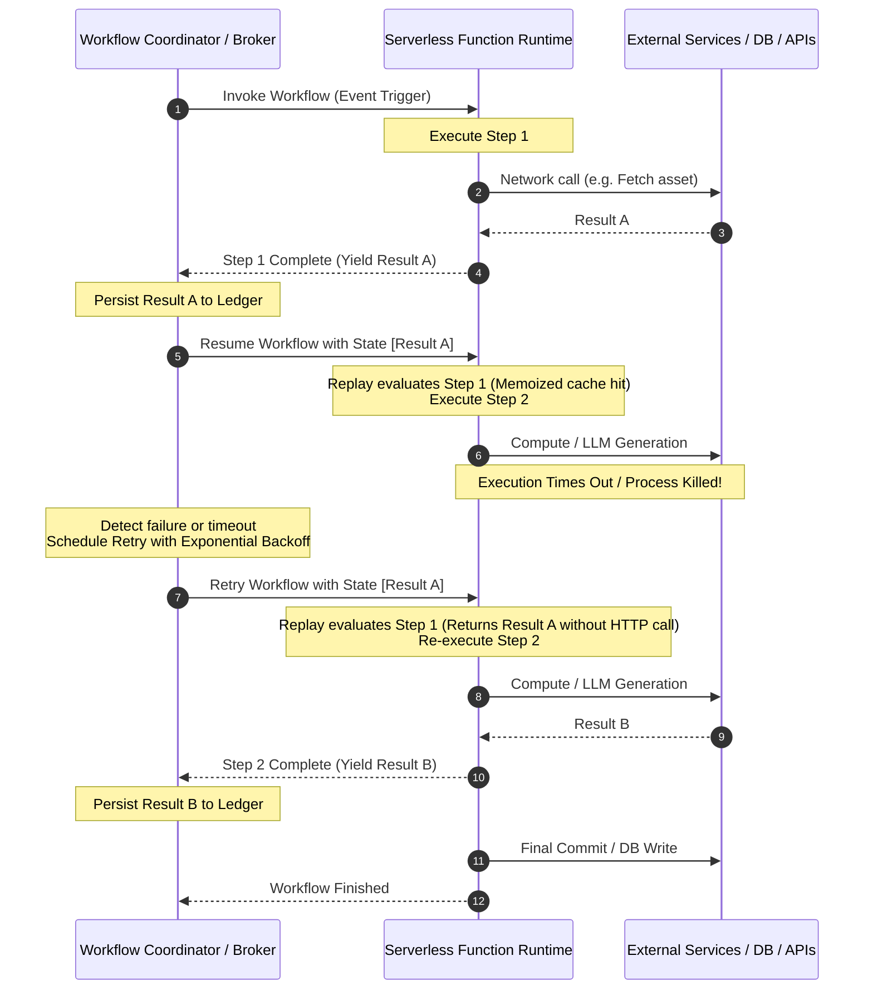

# 001 — Durable Execution & Step-Level Memoization in Serverless Workflows

> **Relates to:** Asynchronous workflow orchestration, background job execution, fault-tolerant distributed pipelines  
> **Prerequisites:** Event-driven architecture, distributed state machines, HTTP/serverless execution lifecycles  
> **Canonical reference:** [Replay-Based Durable Workflows & Deterministic Event Sourcing](https://docs.temporal.io/workflows#replays) / [Step-Level Memoization in Event-Driven Engines](https://www.inngest.com/docs/learn/how-functions-run)

---

## What this is

Durable execution is a distributed computing paradigm where multi-step workflows automatically persist their progress across system failures, function timeouts, process crashes, and network partitions. Rather than losing in-flight state when a host process terminates, a durable execution engine records step outcomes to an event ledger and orchestrates function restarts through deterministic replay and step memoization.

This model eliminates the complexity of manual checkpointing, custom state machines, and ad-hoc retry queues when orchestrating long-running, multi-step asynchronous tasks across unreliable cloud infrastructure.

---

## How it works

Traditional serverless runtimes are stateless and impose strict execution timeouts (typically 10 to 300 seconds). Long-running orchestration—such as downloading media, invoking multiple LLMs, and performing database updates—frequently exceeds these execution thresholds or fails mid-pipeline due to downstream rate limits.

Durable execution engines solve this by decomposing a continuous asynchronous function into discrete, isolated steps managed by a central coordinator.



### The Replay and Memoization Loop

When a durable workflow runs:

1. **Initial Run:** The runner executes the function sequentially until it reaches a step boundary (`step.run("step-id", fn)`).
2. **Step Resolution & Suspension:** When a step boundary is invoked:
   - If the step identifier has an entry in the event journal, the SDK immediately resolves the promise with the cached result without invoking the callback.
   - If no entry exists, the callback is executed. Upon completion, the result is serialized and returned to the coordinator, and execution pauses or completes the cycle.
3. **Replay on Resume:** When rescheduled, the function executes from line 1. Deterministic code executes normally until reaching previously completed step boundaries. The engine injects previously memoized values directly into the call site, fast-forwarding execution to the first incomplete step.

### Algorithmic Representation

The execution of a memoized step follows this deterministic evaluation logic:

```typescript
type StepLedger = Map<
  string,
  { status: "completed" | "failed"; data: unknown }
>;

async function executeStep<T>(
  stepId: string,
  stepFn: () => Promise<T>,
  ledger: StepLedger,
  checkpoint: (id: string, value: T) => Promise<void>,
): Promise<T> {
  // 1. Check if step output was already recorded in previous iterations
  if (ledger.has(stepId)) {
    const record = ledger.get(stepId)!;
    if (record.status === "completed") {
      return record.data as T;
    }
    throw record.data; // Re-throw recorded error if previously failed deterministically
  }

  // 2. Execute the isolated unit of work
  try {
    const result = await stepFn();
    // 3. Suspend & commit result to the durable ledger
    await checkpoint(stepId, result);
    return result;
  } catch (error) {
    // 4. Handle transient vs fatal failures
    throw error;
  }
}
```

### Invariants for Deterministic Replay

For replay-based durable execution to function correctly, the orchestrating function outside of step blocks must adhere to strict behavioral constraints:

1. **Determinism Outside Steps:** Code executed outside a `step.run` must be purely deterministic. Random numbers (`Math.random()`), current timestamps (`Date.now()`), or external global mutations must either reside inside a memoized step or use deterministic time providers supplied by the workflow engine.
2. **Immutable Step Identifiers:** Step identifiers must remain static across iterations. Changing step names dynamically during runtime changes the lookup keys in the ledger, causing the engine to execute already-completed actions again.
3. **JSON Serializability:** All data returned across step boundaries must be serializable (e.g., standard JSON data structures). Circular references, database connections, and live socket handles cannot be persisted across step transitions.

---

## Trade-offs

| Advantage                                                                                                                                                              | Limitation / Operational Trade-off                                                                                                                                              |
| :--------------------------------------------------------------------------------------------------------------------------------------------------------------------- | :------------------------------------------------------------------------------------------------------------------------------------------------------------------------------ |
| **Fault Isolation:** Transient network blips or downstream outages only fail and retry the specific affected step, not the entire pipeline.                            | **Serialization Overhead:** Every step payload must be transmitted over the wire and persisted in a ledger, introducing latency and storage costs for large payloads.           |
| **Cost & Resource Efficiency:** Cloud compute functions can exit while waiting for long delays or external webhooks, consuming zero CPU cycles while idle.             | **Replay Cost:** Functions re-evaluate preamble code on each replay. While memoized steps do not re-run work, CPU cycles are spent fast-forwarding to the active step.          |
| **Idempotency Preservation:** Expensive or non-idempotent operations (such as credit card charges or generative AI tokens) are never re-billed on downstream failures. | **Deterministic Code Restrictions:** Developers must write workflow definitions carefully, avoiding non-deterministic branching or side-effects outside explicit step wrappers. |

---

## Further reading

- [Temporal Architecture: Workflows, Activities, and Event History](https://docs.temporal.io/workflows)
- [Enterprise Integration Patterns: The Saga Pattern for Distributed Orchestration](https://microservices.io/patterns/data/saga.html)
- Related concepts in this repository:
  - [002 — Low-Latency Bidirectional Audio & Interruption Handling in Voice Agents](002-realtime-voice-agent-orchestration.md)
  - [003 — Speaker Diarization Alignment & Conversational Turn Reconstruction](003-speaker-diarization-and-turn-reconstruction.md)
