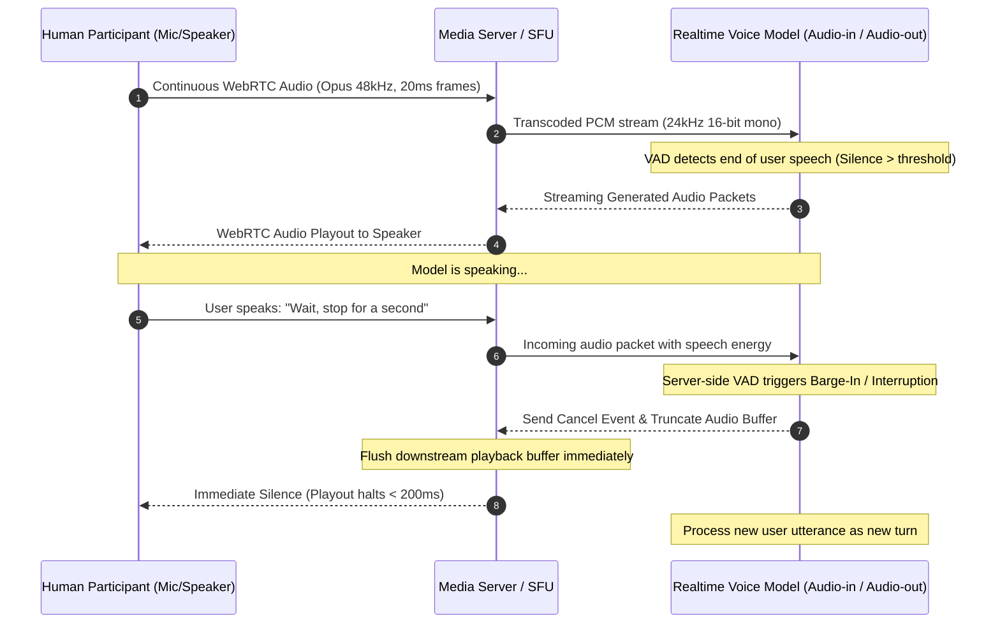

# 002 — Low-Latency Bidirectional Audio & Interruption Handling in Voice Agents

> **Relates to:** Real-time media streaming, WebRTC audio transport, Voice Activity Detection (VAD), full-duplex conversational AI  
> **Prerequisites:** WebRTC peer connection lifecycles, PCM/Opus audio encodings, WebSocket event loops  
> **Canonical reference:** [RFC 7874: WebRTC Audio Processing Requirements](https://datatracker.ietf.org/doc/html/rfc7874) / [Full-Duplex Speech & Barge-In Protocols](https://webrtc.org/)

---

## What this is

Real-time conversational voice agents require full-duplex audio communication where humans and AI models can speak, listen, and interrupt each other with human-like conversational latency (sub-500ms). Unlike traditional half-duplex speech systems that follow rigid "listen-then-transcribe-then-respond" cycles, bidirectional audio orchestration streams audio frames continuously while synchronizing server-side Voice Activity Detection (VAD) and immediate audio stream cancellation on interruption.

---

## How it works

A low-latency conversational voice system bridges peer audio streams through a media server or Selective Forwarding Unit (SFU) directly to an audio-native neural model runtime.



### 1. Media Transport vs. Event Control Planes

Bidirectional voice agents utilize dual communication planes operating in parallel:

1. **The Media Plane (UDP / RTP via WebRTC):** Transports continuous raw audio streams with minimum packet overhead and zero head-of-line blocking. Packets are dropped rather than retransmitted if delayed, maintaining strict temporal synchronization.
2. **The Control / Signaling Plane (WebSocket / DataChannel):** Transports discrete JSON-RPC messages controlling session instructions, tool invocations, audio output truncation events, and state mutations.

### 2. Voice Activity Detection (VAD) and Turn Detection

Natural conversation hinges on identifying when a speaker has finished their thought versus pausing briefly to breathe. Systems deploy two primary turn-detection strategies:

- **Energy-Based & Semantic VAD:** Monitors the root-mean-square (RMS) energy or acoustic spectral features of incoming PCM chunks. When volume remains below a defined silence threshold for a configured duration (e.g., $300\text{ms} \le \Delta t \le 600\text{ms}$), the engine automatically emits an `input_audio_buffer.commit` event and signals the generator to begin synthesis.
- **Semantic Turn Prediction:** A lightweight acoustic/text model predicts whether the trailing linguistic fragment is syntactically and semantically complete, preventing unnatural interruptions during mid-sentence hesitation.

### 3. The Barge-In (Interruption) State Machine

When an AI agent is streaming audio output and the user begins speaking, the system must abort playback instantly to avoid the perception of talking over the user.

```
       [ Idle / Listening ]
               |
         User speaks (VAD Triggered)
               v
      [ User Transcribing ]
               |
      Silence detected (Turn Committed)
               v
       [ AI Synthesizing ]
               |
         Audio Packets Streaming
               v
       [ AI Speaking ]
          |        |
          |        +--> AI finishes audio naturally --> [ Idle / Listening ]
          |
  User speaks during playback! (Barge-In Detected)
          |
          v
   [ Abort & Truncate ]
   1. Send `playback_cancel` event to control plane
   2. Clear media server jitter / playout queues
   3. Tell model to truncate its history at playback offset
          |
          v
   [ User Transcribing ] (New Turn Begins)
```

### 4. Audio Truncation and Context Alignment

When an interruption occurs, the text/audio history maintained in the model's conversation buffer must reflect _only what the user actually heard_, not what the model speculatively generated ahead of time.

If the model generated 10 seconds of speech ($A_{0..10}$), but the user interrupted after 2.4 seconds ($A_{0..2.4}$), the client or media bridge calculates the audio playout cursor:

$$\text{Playhead Offset (samples)} = \frac{\text{Bytes Played}}{\text{Bytes Per Sample} \times \text{Sample Rate}}$$

The controller sends a truncation instruction specifying this exact millisecond offset. This ensures subsequent generation turns do not refer to unuttered or cut-off assertions as established conversation facts.

---

## Trade-offs

| Design Choice                                 | Pros                                                                                                     | Cons / Risks                                                                                                  |
| :-------------------------------------------- | :------------------------------------------------------------------------------------------------------- | :------------------------------------------------------------------------------------------------------------ |
| **Server-Side VAD**                           | Centralized control; low client compute; consistent behavior across heterogeneous web/mobile clients.    | Network jitter may delay silence detection; requires continuous upstream audio streaming even during silence. |
| **Client-Side VAD**                           | Near-instant local interruption detection; reduces upstream bandwidth by gating microphone transmission. | Fragmented browser audio processing; risk of local clipping if user speaks softly or in noisy environments.   |
| **Aggressive Barge-in Thresholds (<300ms)**   | High conversational responsiveness; feels snappy and natural.                                            | Prone to false-positive interruptions from ambient noises (coughing, background chatter, keyboard clicks).    |
| **Conservative Barge-in Thresholds (>700ms)** | Robust against background noise; ensures complete user utterances.                                       | Feels sluggish; leads to frequent double-talk where both parties speak simultaneously.                        |

---

## Further reading

- [WebRTC 1.0: Real-Time Communication Between Browsers (W3C Recommendation)](https://www.w3.org/TR/webrtc/)
- [IETF RFC 7587: RTP Payload Format for the Opus Speech and Audio Codec](https://datatracker.ietf.org/doc/html/rfc7587)
- Related concepts in this repository:
  - [001 — Durable Execution & Step-Level Memoization in Serverless Workflows](001-durable-execution-and-step-memoization.md)
  - [003 — Speaker Diarization Alignment & Conversational Turn Reconstruction](003-speaker-diarization-and-turn-reconstruction.md)
