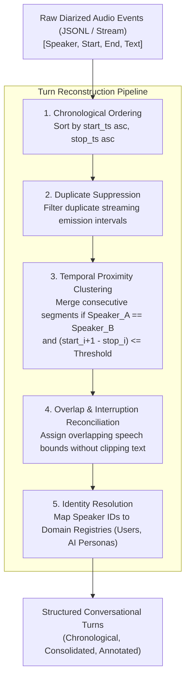
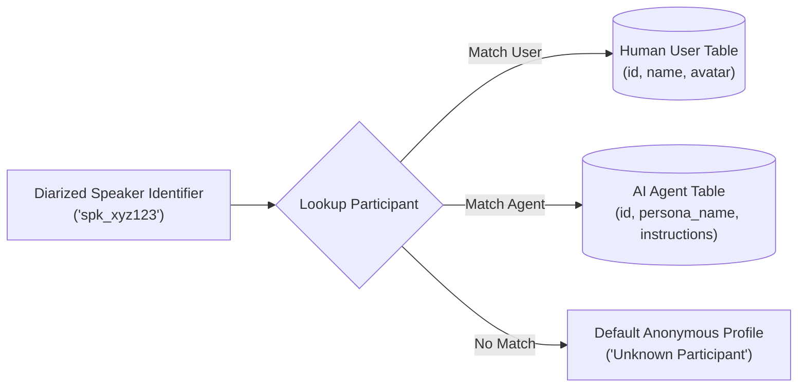

# 003 — Speaker Diarization Alignment & Conversational Turn Reconstruction

> **Relates to:** Speech-to-text processing, audio diarization alignment, time-series interval reduction, NLP/LLM context preparation  
> **Prerequisites:** Audio time-interval arithmetic, sequence processing, basic clustering principles  
> **Canonical reference:** [Speaker Diarization: A Review of Recent Research (IEEE SPM)](https://ieeexplore.ieee.org/document/6165313) / [Temporal Interval Merging in Event Stream Processing](https://en.wikipedia.org/wiki/Interval_tree)

---

## What this is

Speaker diarization answers the question "who spoke when?" by segmenting an audio stream into timestamped intervals and clustering them by speaker identity. However, raw streaming speech recognition produces fragmented, micro-chunked transcription items characterized by overlapping speech boundaries, vocal stutter, and micro-pauses. Conversational turn reconstruction is the algorithmic process of merging, deduplicating, and aligning these disjointed segments into coherent, speaker-attributed dialogue turns suitable for LLM comprehension and UI rendering.

---

## How it works

Raw automated speech recognition (ASR) outputs continuous events containing text, start and end timestamps, and a raw speaker identifier ($S_{\text{id}}$). Rather than a continuous narrative, the raw stream resembles fragmented sentences:

```
[00:01.200 - 00:02.100] User A: "I think"
[00:02.150 - 00:03.400] User A: "we should proceed with option B."
[00:03.200 - 00:04.100] User B: "Wait,"
[00:03.900 - 00:05.200] User B: "does that include the API changes?"
[00:05.400 - 00:06.800] User A: "Yes, exactly."
```

If ingested directly by an LLM or rendered in a user interface without preprocessing, micro-segmentation causes token bloat, disrupts semantic grammar, and fragments speaker turns.



### 1. Temporal Adjacency Thresholds

Two consecutive segments from the same speaker should be merged if the silence interval between them ($\Delta t$) is smaller than an conversational boundary threshold $\theta_{\text{merge}}$ (typically between $500\text{ms}$ and $1500\text{ms}$):

$$\Delta t = \text{start}_{i+1} - \text{stop}_i$$

$$\text{Merge Condition}: \quad (\text{speaker}_{i+1} = \text{speaker}_i) \land (\Delta t \le \theta_{\text{merge}})$$

When the condition holds:

- New $\text{start} = \text{start}_i$
- New $\text{stop} = \max(\text{stop}_i, \text{stop}_{i+1})$
- New $\text{text} = \text{trim}(\text{text}_i) + \text{" "} + \text{trim}(\text{text}_{i+1})$

### 2. Overlapping Speech and Interruption Handling

In multi-party discussions, participants frequently speak over one another (cross-talk). Handling overlaps requires separating temporal bounding from linguistic attribution:

- **Audio-level Overlap:** Multiple audio tracks or SFU streams have concurrent sound energy.
- **Text-level Preservation:** Text must not be spliced together mid-word. Instead, conversational turns are preserved as interleaved blocks where the onset timestamp governs chronological positioning.

### 3. Reconstruction Algorithm

Below is a reference implementation of the turn reconstruction algorithm:

```typescript
interface TranscriptSegment {
  speakerId: string;
  text: string;
  startTs: number; // in milliseconds
  stopTs: number; // in milliseconds
}

interface ConsolidatedTurn {
  speakerId: string;
  text: string;
  startTs: number;
  stopTs: number;
}

function reconstructTurns(
  segments: TranscriptSegment[],
  mergeThresholdMs = 1200,
): ConsolidatedTurn[] {
  if (segments.length === 0) return [];

  // Step 1: Ensure strict temporal ordering
  const sorted = [...segments].sort(
    (a, b) => a.startTs - b.startTs || a.stopTs - b.stopTs,
  );

  const turns: ConsolidatedTurn[] = [];
  let currentTurn = { ...sorted[0] };

  for (let i = 1; i < sorted.length; i++) {
    const nextSegment = sorted[i];
    const isSameSpeaker = nextSegment.speakerId === currentTurn.speakerId;
    const silenceGap = nextSegment.startTs - currentTurn.stopTs;

    // Step 2: Merge consecutive utterances within proximity threshold
    if (isSameSpeaker && silenceGap <= mergeThresholdMs) {
      currentTurn.text = `${currentTurn.text.trim()} ${nextSegment.text.trim()}`;
      currentTurn.stopTs = Math.max(currentTurn.stopTs, nextSegment.stopTs);
    } else {
      // Step 3: Flush completed turn and initialize next turn
      turns.push(currentTurn);
      currentTurn = { ...nextSegment };
    }
  }

  turns.push(currentTurn);
  return turns;
}
```

### 4. Dual-Registry Speaker Resolution

Diarization engines identify speakers using opaque cluster IDs or channel tokens (e.g., `user_2sN...`, `spk_0`). In systems featuring both biological participants and synthetic AI agents, resolution requires joining across distinct identity registries:



---

## Trade-offs

| Strategy                                           | Advantages                                                                                      | Drawbacks / Failure Modes                                                                                                         |
| :------------------------------------------------- | :---------------------------------------------------------------------------------------------- | :-------------------------------------------------------------------------------------------------------------------------------- |
| **Aggressive Merging ($\theta > 2000\text{ms}$)**  | Consolidates monologues into clean paragraphs; minimizes UI chat bubbles and LLM prompt tokens. | Can mistakenly absorb deliberate rhetorical pauses; hides real conversation pacing.                                               |
| **Conservative Merging ($\theta < 500\text{ms}$)** | Captures micro-reactions and precise timestamp accuracy for video seeking.                      | Leads to fragmented single-word turns ("Yeah", "Okay", "Right") that bloat document length.                                       |
| **Streaming Chunking vs. Batch Diarization**       | Streaming provides immediate live captions; low latency.                                        | Cluster drift: Speaker $A$ may be identified as $S_1$ in minute 2, but re-clustered as $S_3$ in minute 15 due to limited context. |
| **Offline Global Alignment**                       | Maximizes diarization accuracy and speaker clustering across the entire audio waveform.         | High latency; cannot be used for live closed-captions or immediate real-time bot responses.                                       |

---

## Further reading

- [NVIDIA NeMo Diarization & Speaker Recognition Documentation](https://docs.nvidia.com/deeplearning/nemo/user-guide/docs/en/main/asr/speaker_diarization/intro.html)
- [Kaldi Speech Recognition & Diarization Toolkit](https://kaldi-asr.org/)
- Related concepts in this repository:
  - [001 — Durable Execution & Step-Level Memoization in Serverless Workflows](001-durable-execution-and-step-memoization.md)
  - [002 — Low-Latency Bidirectional Audio & Interruption Handling in Voice Agents](002-realtime-voice-agent-orchestration.md)
